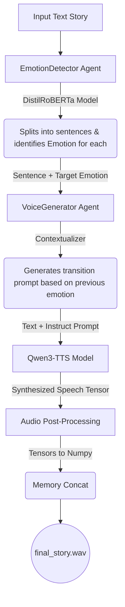

# Emotional Storyteller - Qwen3-TTS & BERT

This project is a storytelling agent that converts text into emotionally expressive speech by chaining a text emotion-detection model and an advanced audio-generation model.

## Architecture Pipeline



1. **Emotion Detection (`EmotionDetector`)**:
   - Analyzes the input text using a pre-trained DistilRoBERTa model (`j-hartmann/emotion-english-distilroberta-base`).
   - Slices the text into individual sentences and maps each sentence to a specific emotion (e.g., happiness, sadness, fear).

2. **Voice Generation (`VoiceGenerator`)**:
   - Uses **Qwen3-TTS (12Hz, 1.7B CustomVoice)** to perform the Text-to-Speech synthesis.
   - For smooth transitions, it contextualizes earlier identified emotions. It leverages the underlying language model in Qwen3-TTS by passing complex text-based `instruct` strings that describe how to smoothly blend and transition the tone from one sentence to the next.

3. **Audio Post-Processing**:
   - Synthesized sentences are fetched as tensor arrays and immediately converted to raw `float32` numpy arrays without intermediate disk I/O.
   - All sentences are sequentially concatenated in memory.
   - The final output is saved directly as a `.wav` file into the `output/` folder using `soundfile`.

## Project Setup

### 1. Requirements
Install the required packages using pip inside your virtual environment:
```bash
python3 -m venv venv
source venv/bin/activate
pip install -r requirements.txt
pip install python-dotenv
```

### 2. Configuration
Create a `.env` file in the root directory (or use the one provided) to specify your local model paths:
```env
MODEL_PATH=/path/to/your/Qwen3-TTS-12Hz-1.7B-CustomVoice
TOKENIZER_PATH=/path/to/your/Qwen3-TTS-Tokenizer-12Hz
```

### 3. Usage
Modify the `text` variable in `main.py` with your custom story, then run:
```bash
python main.py
```

### 4. Sample Output
Your emotionally-blended, full narrative audio will be synthesized and saved along with any intermediate steps in the `output/` directory.

> **Note:** A sample output (`final_story.wav`) from the default `text` prompt can be found in the `output/` folder.
## Model References

This project uses the following open-source models:

### Emotion Classification

- **DistilRoBERTa Emotion Model**  
  https://huggingface.co/j-hartmann/emotion-english-distilroberta-base

### Text-to-Speech

- **Qwen3-TTS**  
  https://github.com/QwenLM/Qwen3-TTS

Please refer to the respective repositories for licensing and model documentation.
